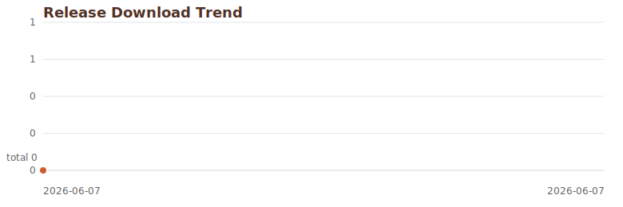

# renovate-courseware-latex

Convert and renovate old courseware into a polished `ctexbeamer` LaTeX slide deck.

This Codex skill is designed for Chinese and English courseware renovation. It preserves the teaching structure of old PPT/PPTX/PDF/DOCX/images/Markdown/HTML materials, rebuilds slides as clean LaTeX Beamer source, compiles with XeLaTeX, and keeps software output exactly as produced by the original system.

## Install

Ask Codex to install it with this prompt:

```text
请帮我安装codex skill [hxh0928/renovate-courseware-latex](https://github.com/hxh0928/renovate-courseware-latex)
```

Or clone this repository into your Codex skills directory:

```bash
mkdir -p ~/.codex/skills
git clone https://github.com/hxh0928/renovate-courseware-latex.git ~/.codex/skills/renovate-courseware-latex
```

Then restart Codex or reload skills. Use the skill by asking for `翻新课件` or by naming `renovate-courseware-latex`.

## Usage

Example prompt:

```text
请用 renovate-courseware-latex 翻新这个旧课件，输出 LaTeX 和 PDF。
课程名称：统计学原理
授课教师：某某
```

If course name or instructor is not provided, the skill will infer them from the source or conversation when possible and remind you that they can be overridden.

## What It Does

- Extracts source courseware structure, text, formulas, tables, diagrams, examples, and code.
- Rebuilds slides using the bundled `ctexbeamer` template.
- Keeps the original courseware language unless the user specifies another target language.
- Preserves software and statistical package output exactly as produced.
- Uses formal slide language and avoids process labels such as “翻新课件” or “课堂提示” in visible slide text.
- Uses consistent `tabularx` alignment for explanatory tables.
- Compiles with XeLaTeX and verifies the generated PDF when possible.

## Repository Layout

```text
.
├── SKILL.md
├── agents/
│   └── openai.yaml
├── assets/
│   ├── ctexbeamer-template.tex
│   └── downloads-line.svg
├── references/
│   └── renovation-rules.md
├── scripts/
│   └── update_download_metrics.py
└── metrics/
    └── download-history.json
```

## Notes

The bundled template uses `ctexbeamer`, `Madrid`, `booktabs`, `tabularx`, `tikz`, `pgfplots`, and `listings`. On older TeX Live installations, the skill may lower `pgfplots` compatibility to the highest supported version while keeping the deck style intact.

To automate the download chart, add a scheduled GitHub Actions workflow that runs `python scripts/update_download_metrics.py` and commits changes to `metrics/download-history.json` and `assets/downloads-line.svg`. Pushing workflow files requires a GitHub token with the `workflow` scope.

## Download Trend




The line chart is generated from GitHub Release asset download counts. Git clone/install counts are not publicly exposed by GitHub, so release downloads are used as the durable public metric.
